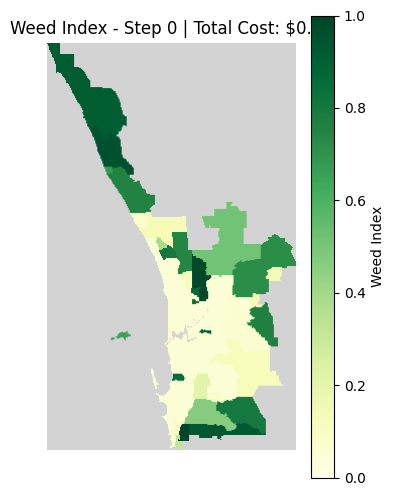
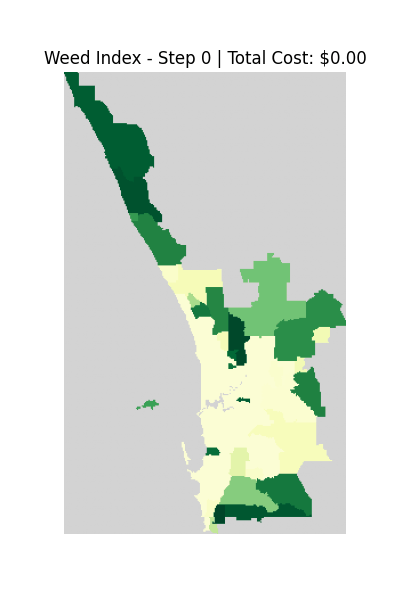

# Introduction

The Cellular Automaton (CA) related code has been encapsulated into the WeedCA class. While direct instantiation is supported, the recommended approach is to use the factory method `polygon_to_weedca()`:

```python
from src.weed_ca import WeedCA

weedca = WeedCA.polygon_to_weedca(gdf, 
                                  pressure_coef=0.05,
                                  cell_size=500,
                                  growth_rate=0.02,
                                  diffusion_rate=0.01)
```

# Object Properties

`WeedCA` objects have the following properties:

| Category | Attribute | Type | Description |
|---|---|---|---|
| Spatial Data | `gdf` | `GeoDataFrame` | A copy of the original polygon-based spatial dataset used to initialize and reset the simulation. |
| Spatial Data | `weed_grid` | `np.ndarray` (`float32`) | A 2D raster grid containing the current Weed Index of each simulation cell. Values are typically between 0 and the carrying capacity; invalid cells are represented by `NaN`. |
| Spatial Data | `valid_mask` | `np.ndarray` (`bool`) | A Boolean mask indicating which grid cells are valid for simulation. `True` represents valid cells, while `False` represents cells outside the simulation area. |
| Spatial Data | `transform` | `Affine` | The spatial transformation that maps grid row/column coordinates to geographic coordinates. It is used for geospatial referencing and exporting the simulation results. |
| Spatial Data | `crs` | `str` / CRS | The Coordinate Reference System (CRS) used by the spatial data and simulation grid. |
| Spatial Data | `cell_size` | `float` | The spatial size of each grid cell, typically measured in metres when using a projected CRS. |
| Initialization Parameters | `pressure_coef` | `float` | Coefficient controlling the effect of population density on the initial Weed Index. |
| Initialization Parameters | `w_min` | `float` | Minimum Weed Index used in the initialization function. |
| Initialization Parameters | `w_max` | `float` | Maximum Weed Index used in the initialization function. |
| Model Parameters | `growth_rate` | `float` | Rate controlling the weekly growth of the Weed Index under the logistic growth model. |
| Model Parameters | `carrying_capacity` | `float` | Maximum Weed Index that the logistic growth process approaches or is constrained by. |
| Model Parameters | `diffusion_rate` | `float` | Coefficient controlling the rate at which Weed Index spreads between neighbouring cells. |
| Policy | `policy` | `Callable` / `None` | The management policy applied during the removal phase. It receives the current Weed Index grid and valid-cell mask and returns the amount of weed removed and the associated cost. |
| Simulation State | `step_counter` | `int` | Number of simulation steps that have been completed. |
| Simulation State | `total_cost` | `float` | Cumulative cost of all management actions performed during the current simulation. |

# Examples

## How can I get the current weed status

Use `show_grid()` method to visualize current weed status:

```python
weedca.show_grid()
```

Example output:



## How can I push the CA to move forward

Simply call `step()` method to push the CA forward:

```{r}
weedca.step()
```

Note: The semantic meaning of one simulation step should be defined in advance. For example, one step may represent one week.

## How can I get animated simulation

Call `animate()` method with the frame, FPS (frames per second) and modes (explained later) you want:

```python
weedca.animate(frames=108, fps=20)
```

Example Output:



## How can I select the simulation methods I want

By passing a modes list to the simulation methods, the CA will only execute the specified processes:

```python
modes = ['growth', 'diffusion']
weedca.animate(frames=108, fps=20, modes=modes)
```

In this example, the removal process will be omitted from the simulation.

## How does the removal function work and how can I register my policy function to CA

First, define a policy function and register it using the `register_policy()` method:

```python
def simple_removal(weed_grid, mask):
    weed_grid[~mask] = 0    # set invalid cell to 0
    diff = weed_grid * 0.001 # remove 0.001 times weed index of each cell
    cost = np.sum(diff * 200) # cost is all removal times 200 dollars

    return diff, cost

weedca.register_policy(simple_removal)
```

The registered removal policy will then be applied during subsequent simulations when the removal mode is enabled.

The policy function receives the following parameters at each simulation step:

|Parameter|Meaning|
|---|---|
|weed_grid|A grid represent weed index at current timestep|
|valid_mask|A bool mask indicates valid cells (True -> Land; False -> Sea or out-of-boundary)|

The policy function should calculate the amount of Weed Index to remove from each cell and return:

- diff: a non-negative matrix with the same shape as weed_grid;
- cost: a scalar (float) representing the management cost for the current timestep.

The CA subsequently subtracts diff from the current Weed Index grid and adds cost to `total_cost`.

## Which parameters should I choose during simulation process

The parameters should be interpreted according to the semantic meaning assigned to one simulation step.

For example, if one simulation step represents one week, a `growth_rate` of 0.02 means that the growth component is evaluated at a rate of 2% per week when the Weed Index is low relative to its carrying capacity.

For comparison, under a simple unconstrained exponential-growth assumption:

```python
(1 + 0.02) ** 52    # 2.8003281854481816
```

In other words, a constant 2% weekly growth rate would result in the index becoming approximately 2.8 times its initial value after one year.

For `diffusion_rate`, the parameter controls the amount of Weed Index transferred or propagated from neighbouring cells according to the diffusion rule. A conservative starting point is to set it lower than the growth rate, for example around one-half or one-quarter of `growth_rate`, and then evaluate the resulting behaviour through sensitivity analysis.
